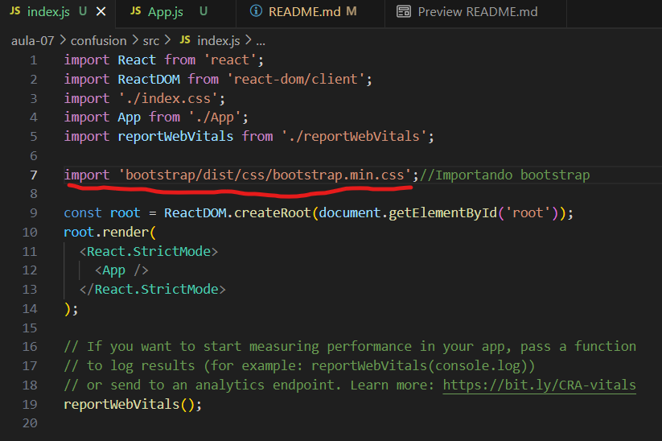
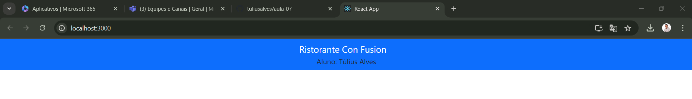

# aula-07
<h2>Cronograma da aula 07</h2>

<h3>Instalação básica do react</h3>
<ul>
<li>npm install -g create-react-app </li>
</ul>

<h3>Gerando e servindo um projeto React usando create-react-app</h3>
<ul>
<li>npx create-react-app confusion </li>
</ul>

<h3>Configurando o react e o bootstrap</h3>
<ul>
<li>npm install reactstrap react react-dom </li>
<li>npm install --save bootstrap</li> 
<li>npm install react-popper @popperjs/core </li>
</ul>

<h3>Importando o bootstrap no arquivo index.js.</h3>
<ul>

</ul>

<h3>Adicionando uma barra de navegação</h3>
<ul>
<li>Apague a tag "header" e seu conteúdo.</li>
<li>Depois insira as informações da tag "Navbar" junto com o nome do aluno.</li>

</ul>

<h3>Anotações técnicas...</h3>

<h4>React</h4>

É uma biblioteca javaScript usada para criar interfaces de aplicação web. 

<h4>div</h4>

Funciona como um um bloco de tags dentro do html. Nele nós podemos separar

elementos em locais do html, para assim, poder organizar melhor o nosso site

Assim como outras tags, a div também pode ser identificada através de seu 

"className".

<h4>Bootstrap</h4>

É uma framework utilizada para criar sites e aplicações web responsivas de forma 

rápida e eficiente. 

<h3>Considerações sobre os elementos de bootstrap adicionados</h3>

<h4>Navbar</h4>

Equivale a um "cabeçalho" de navegação responsivo do bootstrap.A responsividade é

a maneira como os elementos vão se comportar as diferentes telas.

A navbar possuí algumas propriedades, no caso o darkcolor="primary" equivale

a cor de fundo da navbar.

NavbarBrand é um componente do bootstrap que cria um logotipo dentro da barra

do navbar.

<h2>Resultado</h2>

