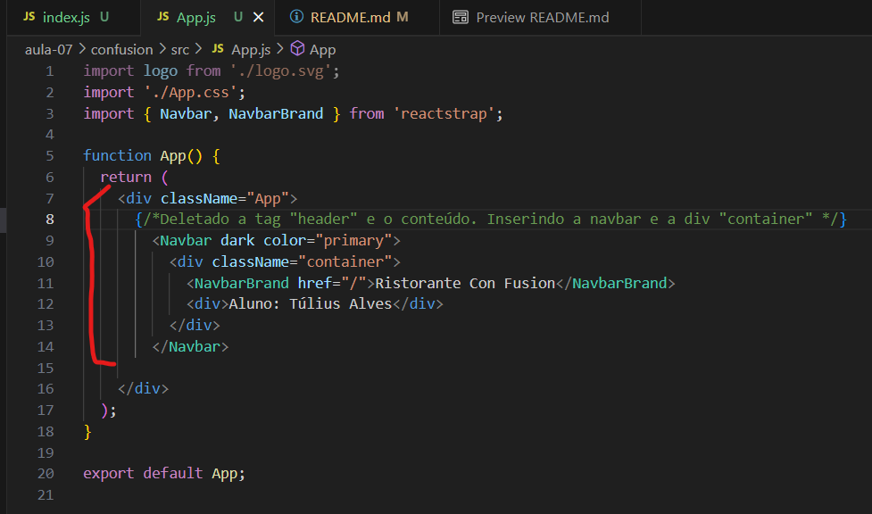

# aula-07
<h2>Cronograma da aula 07</h2>

<h3>Instalação básica do react</h3>
<ul>
<li>npm install -g create-react-app </li>
</ul>

<h3>Gerando e servindo um projeto React usando create-react-app</h3>
<ul>
<li>npx create-react-app confusion </li>
</ul>

<h3>Configurando o react e o bootstrap</h3>
<ul>
<li>npm install reactstrap react react-dom </li>
<li>npm install --save bootstrap</li> 
<li>npm install react-popper @popperjs/core </li>
</ul>

<h3>Importando o bootstrap no arquivo index.js.</h3>
<ul>

</ul>

<h3>Adicionando uma barra de navegação</h3>
<ul>
<li>Apague a tag "header" e seu conteúdo.</li>
<li>Depois insira as informações da tag "Navbar" junto com o nome do aluno.</li>

</ul>

<h2>Resultado</h2>

